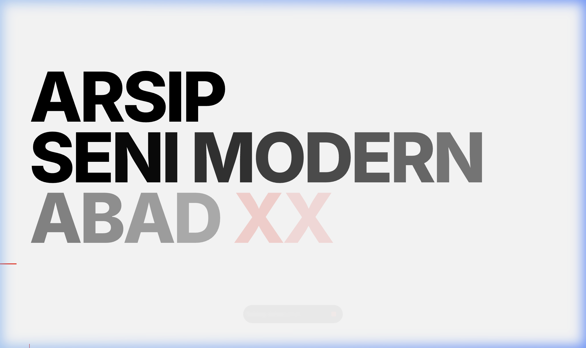
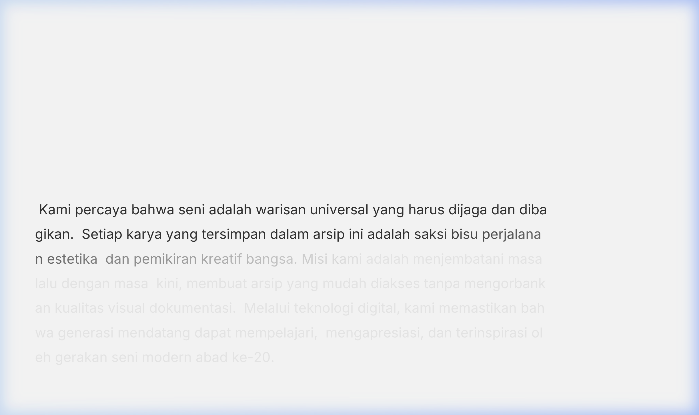
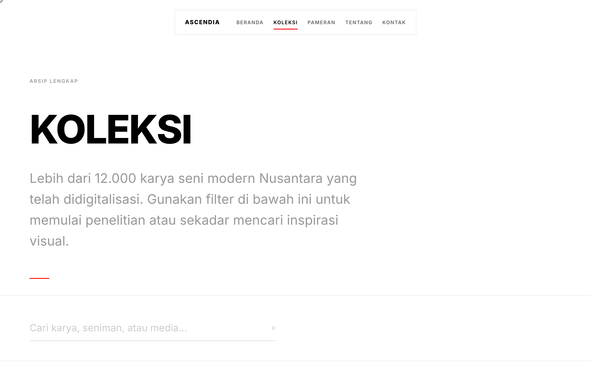
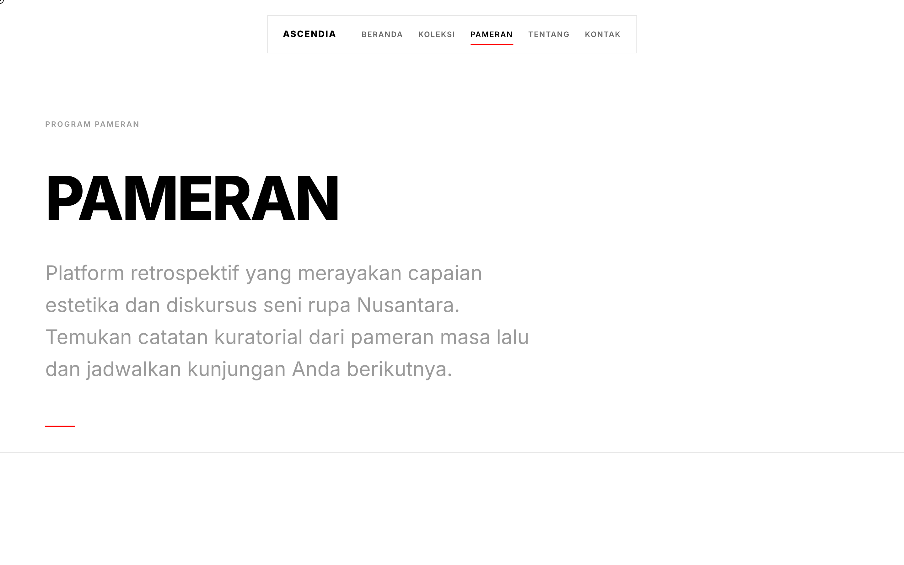
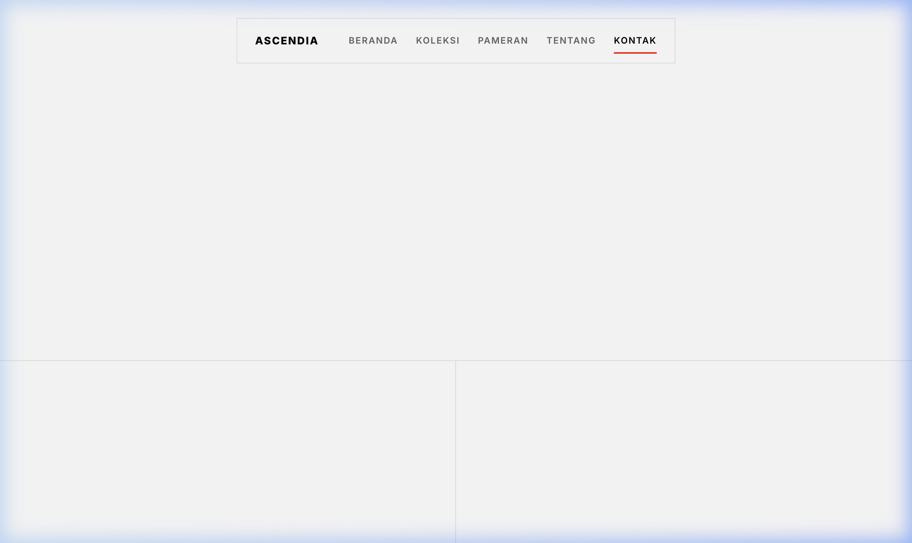

# ASCENDIA — Arsip Seni Modern Abad XX



Ascendia adalah platform rintisan berbentuk **Arsip Digital** yang didedikasikan untuk melestarikan dan mendokumentasikan gerakan serta mahakarya seni modern Nusantara sepanjang abad ke-20 (1921–2000). 

Proyek ini mendemonstrasikan implementasi estetika **Swiss Style / International Typographic Style** ke dalam medium web modern, dikombinasikan dengan interaksi scroll yang *cinematic* dan mulus menggunakan **GSAP** (GreenSock Animation Platform) dan **Lenis**.

## 🎨 Eksplorasi Visual: Swiss Style & Interaksi

Misi utama dari UI/UX proyek ini adalah menghadirkan nuansa premium, bersih, dan berbobot menyerupai buku seni (art book) atau pameran galeri retro-modern.

Fitur kunci dalam pengalaman UI:
- **Cinematic Loader:** Perhitungan counter statis dengan *split-panel reveal*.
- **Scroll-scrub Typography:** Teks besar pada hero section yang muncul perlahan seiring kecepatan scroll pengguna.
- **Horizontal Pinned Gallery:** Section karya unggulan yang memaksa arah scroll menjadi horizontal sementara layar ditahan (pinned).
- **Magnetic Navigation:** Navigasi melayang yang bereaksi terhadap kursor seperti magnet dengan efek kaca presisi (backdrop-blur).
- **Custom Hardware Cursor:** Kursor *crosshair* presisi dengan efek `mix-blend-mode: difference` untuk visibilitas di semua warna latar, dan mengembang saat melewati elemen interaktif.

## 🖼️ Tangkapan Layar (Screenshots)

Berikut preview beberapa halaman, yang seluruhnya ditenagai oleh animasi transisi dinamis:

### 1. Filosofi & Teks Skrol (Beranda)
Teks muncul per-huruf seiring Anda menggulir *(Scroll-scrubbing)*.


### 2. Arsip Koleksi Seni
Tabel data dinamis dengan kemampuan sortir (*sortable*) dan pencarian *real-time*.


### 3. Program Pameran & Linimasa
Kartu pameran asimetris dipadukan dengan linimasa vertikal interaktif.


### 4. Kontak & Identitas
Integrasi form bergaya *floating labels* dengan identitas tata letak yang konsisten.


---

## 🛠️ Stack Teknologi

Proyek ini menjaga performa tinggi dan keterbacaan kode yang optimal dengan tetap sangat dekat dengan native/vanilla environment:

- **Framework Dasar:** Vite (Vanilla JS)
- **Styling:** Vanilla CSS (menggunakan CSS Variables untuk Sistem Desain)
- **Animasi Core:** GSAP (termasuk ScrollTrigger)
- **Smooth Scroll:** Lenis (untuk sensasi scroll mulus dan pergerakan GSAP yang lebih mengalir tanpa *jitter*)
- **Tipografi:** *Inter* (sebagai penghormatan interpretasi modern pada Helvetica)

---

## 🚦 Cara Menjalankan Proyek Secara Lokal

Memulai proyek ini sangat sederhana:

1. **Clone repository ini**
   ```bash
   git clone https://github.com/username/ascendia.git
   cd ascendia
   ```

2. **Instal seluruh *dependencies*** (pastikan Anda menggunakan Node.js versi terbaru):
   ```bash
   npm install
   ```

3. **Jalankan *Development Server*:**
   ```bash
   npm run dev
   ```

4. **Kunjungi antarmuka web**
   Buka URL yang disediakan (umumnya `http://localhost:5173/`) pada browser pilihan Anda untuk merasakan performa dan animasinya.

---

## 🏗️ Struktur Proyek

```text
ascendia/
├── index.html        # Halaman Utama (Interaktif)
├── koleksi.html      # Demo tabel data koleksi karya
├── pameran.html      # Demo timeline program pameran
├── tentang.html      # Halaman profil yayasan & cerita
├── kontak.html       # Halaman form & koneksi
├── /styles/          # Style base modular Vanilla CSS
│   ├── main.css      # Core token desain asimetris Swiss Style
│   ├── loader.css    # Animasi frame awal
│   └── ...           # CSS spesifik tiap halaman
├── /src/
│   ├── main.js       # GSAP Engine utama untuk spesifik di index
│   ├── subpage.js    # Sistem UI/UX logic navigasi dan kursor global
│   └── koleksi...js  # JavaScript logic filter, pencarian dan tabel visual
└── /docs/images/     # Asset untuk GitHub Markdown 
```

---
*Dibuat untuk menjelajahi batas persilangan antara kemurnian tipografi Swiss dan kapabilitas rendering DOM modern.*
